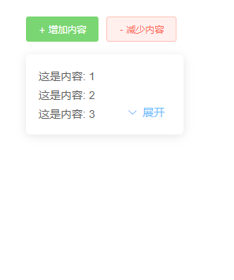
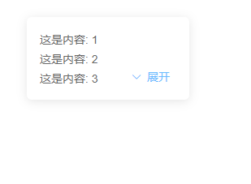
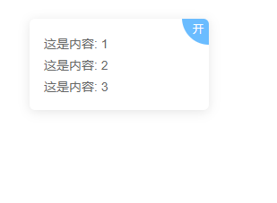

# 简介
一个简易的内容展开收起Vue组件，支持根据内容的改变自动更新组件自身的状态🔨。


<br>

# 引入
这只是一个Vue组件，直接将index.vue文件拷贝到你的Vue项目中，并在需要的页面中引入并注册为一个组件即可！
如：
```javascript
import collapse from '@/components/collapse/index' // 文件对应路径

export default {
    components: {
        collapse
    },
}

```
<br>

# 使用

### 基础用法

直接把展示内容放置到组件中，并设置一个默认高度即可（也可以设置为0）

```HTML
<collapse :default-height="70">
    <div>这是内容...</div>
    <div>样式需要自己添加...</div>
    ...
</collapse>
```


<br>

### 使用v-model

用一个变量绑定组件的状态，并可通过改变来变量控制组件的状态
```HTML
<collapse v-model="isOpen" :default-height="70">
    <div>这是内容...</div>
    <div>样式需要自己添加...</div>
</collapse>
```
```javascript
data(){
    return {
        isOpen: true,
    }
}
```

<br>

### 自定义开关按钮

隐藏内置开关按钮，利用v-model控制或者手动调用方法控制

```HTML
<collapse v-model="isOpen" :default-height="70" hide-controll>
    <div>这是内容...</div>
    <div>样式需要自己添加...</div>
</collapse>
<span class="btn" @click="isOpen = !isOpen">{{isOpen ? '关' : '开'}}</span>
```
```javascript
data(){
    return {
        isOpen: false,
    }
}
```


<br>

# API
### collapse Attributes

参数 | 说明 | 类型 | 可选值 | 默认值
|  ----  | ----  | ----  | ----  | ----  |
v-model | 绑定值，控制内容展开收起 | Boolean | - | -
default-height | 默认显示内容的高度（单位px） | Number | - | 100
hide-controll | 是否隐藏内置控制按钮 | Boolean | - | false
hide-controll-icon | 是否隐藏内置控制按钮的icon（在hide-controll为false的情况下该属性才生效） | Boolean | - | false
fold-text| 内置控制按钮收起的文案 | String | - | “收起”
unfold-text| 内置控制按钮展开的文案 | String | - | “展开”

<br>

### collapse Slots

| name | 说明
| ----  | ----  |
| - | 组件中的内容

<br>

### Methods

方法名 | 说明 |  参数  |
----  | ----  | ----  |
fold | 收起内容 | -
unfold | 展开内容 | -
refresh | 手动刷新组件状态（组件状态自动更新异常时可尝试着手动调用刷新） | -